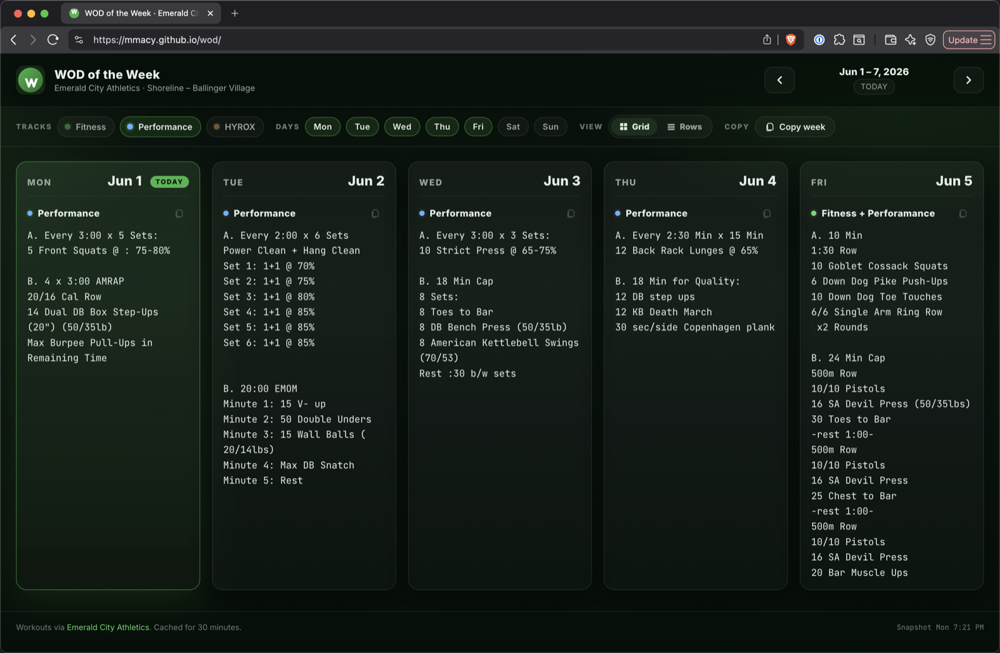

# WOD Viewer

An alternate, mobile-friendly view of the weekly Workout of the Day for
Emerald City Athletics — Shoreline / Ballinger Village.

**Live**: <https://mmacy.github.io/wod/>

> Unofficial fan project. All workout programming is created and owned by
> [Emerald City Athletics](https://emeraldcitygyms.com/shoreline-ballinger-village/group-class-schedule/)
> and delivered through the SugarWOD widget embedded on the gym's official
> schedule page — that remains the canonical source. This project just
> rearranges the same public data into a layout that's a little easier to
> scan side-by-side. If anyone at ECA or SugarWOD would prefer it taken
> down, open an issue here and I'll do that.



## Features

- Whole-week view with each track laid out side-by-side.
- Grid and Rows layouts; preference persists in `localStorage`.
- Track filters (HYROX is off by default — re-enable it any time).
- Day filters Mon–Sun.
- Per-workout copy button (plain text, friendly for texting) and a
  "Copy week" button that exports Markdown — handy for pasting into
  Claude / Gemini / ChatGPT to talk about the week.
- Keyboard: `←` / `→` switch weeks, `t` jumps to today.

## How it runs

### Hosted — GitHub Pages, refreshed once a day

The live URL is built by `.github/workflows/deploy-pages.yml`, which only
fires on three triggers:

- **Once per day** on a cron of `0 13 * * *` UTC (≈ 5–6 am Pacific).
- On push to `main` when the site source actually changes (templates,
  static assets, the fetch script, or the workflow itself).
- Manually via `gh workflow run deploy-pages.yml`.

Each run calls the SugarWOD widget endpoint for a 7-week window (2 weeks
back through 4 weeks forward, Monday-anchored), bundles the result into
`data/wod.json`, and publishes the static site via Pages. The snapshot
lives only in the deployed Pages artifact — nothing is committed to the
repo, so `main` stays clean.

That's it. No background polling, no per-visitor calls to upstream — every
visitor reads the same daily JSON snapshot baked at build time.

### Locally — `python3 app.py`

Useful for development, or to browse weeks outside the hosted 7-week
window. Requires Python 3.9+; no third-party packages.

```bash
python3 app.py
# → http://127.0.0.1:8000
```

| Flag      | Default     | Description                          |
| --------- | ----------- | ------------------------------------ |
| `--port`  | `8000`      | Port to listen on                    |
| `--host`  | `127.0.0.1` | Use `0.0.0.0` to expose on the LAN   |

The local server proxies the SugarWOD widget API and caches each day's
response in memory for 30 minutes, so reloading the page doesn't hit
upstream again.

### Same files, both modes

`static/app.js` first tries to fetch `data/wod.json`. If a JSON snapshot
is present it uses that (hosted mode). Otherwise it falls back to the
local `api/week` endpoint served by `app.py` (dev mode). The browser
picks the right path automatically depending on where the page is served
from.

## Being polite to upstream

- Hosted: at most one snapshot fetch per day (plus the rare push or
  manual trigger).
- Local: 30-minute in-memory cache per day, up to 4 days fetched in
  parallel.
- Requests carry a clear `User-Agent` so the upstream can identify and
  contact the project if needed.
- No scraping, no login — only the same public widget JSON that the
  gym's own website loads.

## Bootstrapping Pages on a fork

```bash
gh api --method POST repos/{owner}/{repo}/pages -f build_type=workflow
gh workflow run deploy-pages.yml
```

## Run the snapshot script locally

To preview exactly what the hosted site sees:

```bash
python3 scripts/fetch_wod.py --out site/data/wod.json
cp templates/index.html site/index.html
cp -R static/. site/static/
python3 -m http.server --directory site 8000
# → http://127.0.0.1:8000
```

`scripts/fetch_wod.py` accepts `--before N` and `--after N` to change the
week window (default `--before 2 --after 4`).

## Project layout

```
app.py                              # local dev server + SugarWOD proxy
scripts/fetch_wod.py                # builds the multi-week snapshot
templates/index.html                # shell page (shared by both modes)
static/style.css                    # dark, responsive theme
static/app.js                       # render + snapshot-first w/ API fallback
.github/workflows/deploy-pages.yml  # daily Pages build & deploy
```
